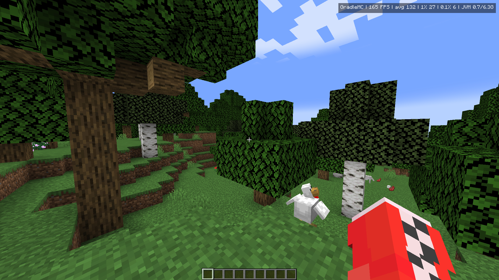
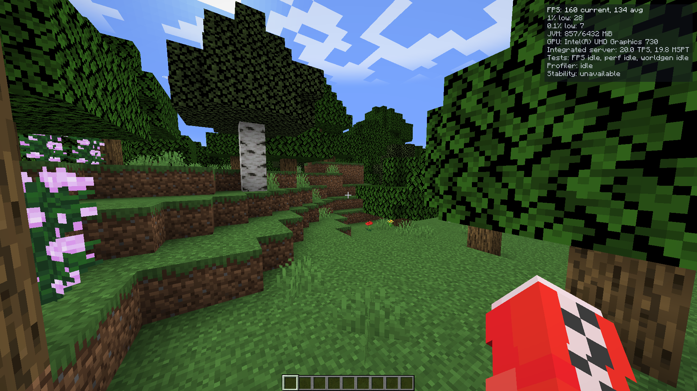
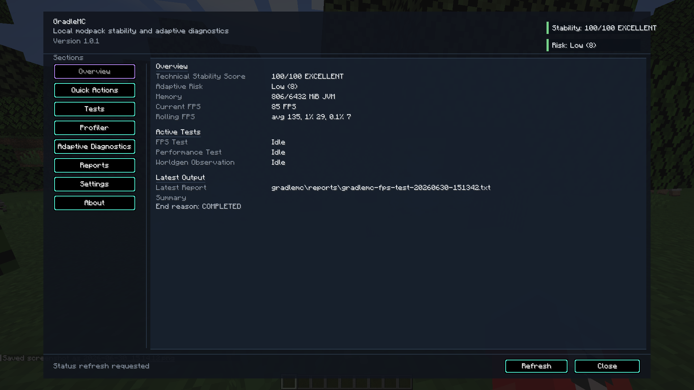
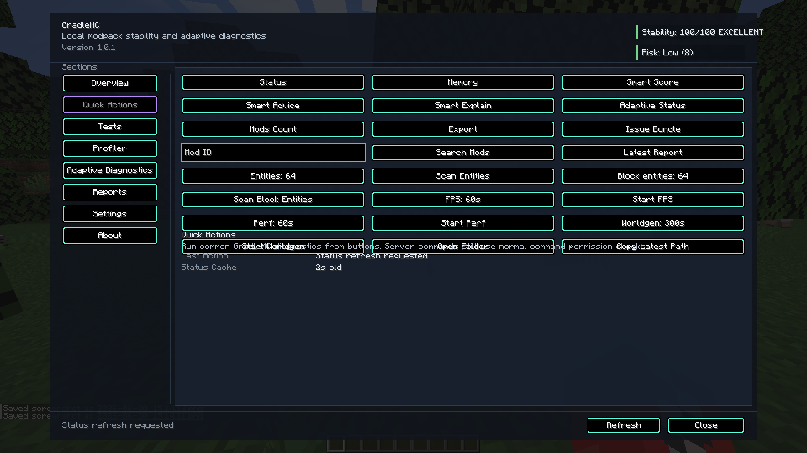

# GradleMC

<p align="center">
  
</p>

<p align="center">
  <strong>In-game diagnostics, stability checks, Smart Diagnostics, and exportable troubleshooting reports for Minecraft modpacks.</strong>
</p>

<p align="center">
  <a href="https://github.com/SoumyajitXD/GradleMC/actions/workflows/ci.yml"></a>
  
  
  
  
  
  
</p>

<p align="center">
  <a href="#overview"><strong>Overview</strong></a>
  · <a href="#supported-releases">Releases</a>
  · <a href="#quick-start">Quick Start</a>
  · <a href="#features">Features</a>
  · <a href="#server-hosting">Server Hosting</a>
  · <a href="#screenshots">Screenshots</a>
  · <a href="#build-from-source">Build</a>
</p>

---

## Overview

GradleMC is a diagnostics mod for modded Minecraft. It helps players, modpack makers, server owners, and testers inspect a modded instance before troubleshooting turns into blind guessing.

It provides an in-game control center, readable `/gradlemc` commands, stability checks, memory diagnostics, mod and environment inspection, bounded performance sampling, Smart Diagnostics, adaptive local diagnostics, and exportable reports.

**Current public support:** Minecraft Java Edition `1.20.1` on Forge and Fabric. Other loaders and versions are not supported until the code, build, runtime behavior, docs, and artifact names all agree.

---

## Supported Releases

| Loader | Public version | Artifact | Minecraft | Java | Notes |
| --- | --- | --- | --- | --- | --- |
| Forge | `1.0.2` | `gradlemc-1.0.2-forge-1.20.1.jar` | `1.20.1` | `17` | Forge target `47.4.20`; hotfix for the Quick Actions tab overlay issue |
| Fabric | `1.0.0` | `gradlemc-fabric-1.20.1-1.0.0.jar` | `1.20.1` | `17` | Fabric release |

| Field | Value |
| --- | --- |
| CurseForge project ID | `1585182` |
| License | Apache-2.0 |
| Telemetry | None |
| Cloud AI or LLM usage | None |

**Latest Forge release:** `1.0.2` is a Forge `1.20.1` hotfix release. It keeps the same public target and fixes the Quick Actions tab overlay issue instead of pretending to be a giant feature drop wearing sunglasses.

---

## Quick Start

1. Use Minecraft Java Edition `1.20.1`.
2. Use Java `17`.
3. Pick the jar that matches your loader.
4. Put the jar in the instance or server `mods` folder.
5. Install it on the client for the GUI, keybind, overlay, and client FPS sampling.
6. Install it on the server for commands, TPS/MSPT sampling, reports, issue bundles, passive worldgen observation, and Smart Diagnostics summaries.

Open the GUI:

```text
/gradlemc gui
```

Useful commands:

```text
/gradlemc status
/gradlemc version
/gradlemc memory
/gradlemc check
/gradlemc export
/gradlemc smart score
/gradlemc smart advice
```

Minecraft commands are lowercase. Use `/gradlemc`, not `/GradleMC`.

---

## Features

| Feature | What it does |
| --- | --- |
| Diagnostics GUI | In-game control center for checks, status, reports, and diagnostics. |
| Command tree | Lowercase `/gradlemc` commands for status, memory, checks, exports, and Smart Diagnostics. |
| Exportable reports | Local support evidence for cleaner troubleshooting. |
| Environment inspection | Minecraft, loader, Java, GradleMC, loaded-mod, config, and path information. |
| Memory diagnostics | JVM heap pressure and memory context. |
| Performance sampling | Bounded TPS/MSPT, FPS, entity density, block entity density, and worldgen pressure signals. |
| Local profiler foundation | Bounded tick, CPU-lite, memory-lite, and combined TXT/JSON summaries. |
| Smart Diagnostics | Local rule-based scoring, advice, evidence, confidence, trends, and missing-data notes. |
| Adaptive diagnostics | Lightweight local gameplay-state diagnostics without telemetry or cloud inference. |
| Issue-bundle exports | Reviewable support bundles for bug reports and pack support. |

---

## What GradleMC Checks

- Minecraft, loader, Java, GradleMC, and loaded-mod environment details.
- JVM heap pressure and memory status.
- Loaded mod count, previews, and mod ID search.
- Config and report directory access.
- Top-level config-file sanity checks.
- Optional local risk rules from `<gameDir>/gradlemc/rules/gradlemc-rules.json`.
- Nearby entity and block entity density.
- Bounded server TPS/MSPT samples.
- Bounded profiler sessions with TXT/JSON output.
- Passive chunk/worldgen pressure observations.
- Client-only FPS samples.
- Smart Diagnostics scoring, evidence, confidence, missing-data notes, and local aggregate baselines.

Generated output is written under `<gameDir>/gradlemc/`, including `reports/`, `exports/`, `issue-bundles/`, `profiles/`, and `rules/`.

---

## Server Hosting

GradleMC is useful on servers because server support needs evidence, not guesses.

<p align="center">
  <a href="https://url-shortener.curseforge.com/kZ5IK">
    
  </a>
</p>

<p align="center">
  <a href="https://url-shortener.curseforge.com/kZ5IK"><strong>Create a Minecraft server</strong></a>
</p>

Use GradleMC server-side for `/gradlemc` commands, TPS/MSPT sampling, memory and environment reports, loaded-mod inspection, passive worldgen observation, issue-bundle exports, and Smart Diagnostics summaries.

---

## Screenshots

<p align="center">
  
</p>

| Screenshot 1 | Screenshot 2 | Screenshot 3 |
| --- | --- | --- |
|  |  |  |

More screenshots live in [`docs/SCREENSHOTS.md`](docs/SCREENSHOTS.md).

---

## What GradleMC Is Not

- Not a Gradle replacement.
- Not a crash-fixing bot.
- Not Spark, VisualVM, or a deep profiler replacement.
- Not an LLM, generative AI system, cloud AI service, telemetry feature, or analytics feature.
- Not a public support claim for NeoForge, Quilt, Bedrock, or non-`1.20.1` Minecraft versions.

---

## Build From Source

Forge:

```sh
cd "GradleMC/Forge/Minecraft 1.20.1"
./gradlew build
./gradlew gradlemcSelfTest
```

Fabric:

```sh
cd "GradleMC/Fabric/Minecraft 1.20.1"
./gradlew build
```

Windows users can run `gradlew.bat` from the same project folders.

Before publishing anything, make sure source metadata, public release version, docs, changelog, screenshots, and artifact names agree. Use [`docs/RELEASE_CHECKLIST.md`](docs/RELEASE_CHECKLIST.md) before release/export work.

---

## Repository Layout

| Path | Purpose |
| --- | --- |
| [`GradleMC/Forge/Minecraft 1.20.1/`](GradleMC/Forge/Minecraft%201.20.1/) | Forge `1.20.1` source project. |
| [`GradleMC/Fabric/Minecraft 1.20.1/`](GradleMC/Fabric/Minecraft%201.20.1/) | Fabric `1.20.1` source project. |
| [`Screenshots/`](Screenshots/) | README and documentation screenshots. |
| [`bisecthosting-banner.png`](bisecthosting-banner.png) | Server hosting banner asset. |
| [`CHANGELOG.md`](CHANGELOG.md) | Release history. |
| [`ROADMAP.md`](ROADMAP.md) | Public planning and support gates. |
| [`SUPPORT.md`](SUPPORT.md) | Support guide. |
| [`SECURITY.md`](SECURITY.md) | Security policy. |
| [`CONTRIBUTING.md`](CONTRIBUTING.md) | Contribution rules. |
| [`AGENTS.md`](AGENTS.md) | Technical operating manual. |
| [`curseforge-description.html`](curseforge-description.html) | CurseForge description source. |

---

## Contributing

Before opening a PR, read [`CONTRIBUTING.md`](CONTRIBUTING.md) and [`AGENTS.md`](AGENTS.md). Keep Minecraft command examples lowercase. Do not claim loader or version support until implementation, builds, runtime checks, docs, and artifact naming prove it.

Useful Forge checks:

```sh
cd "GradleMC/Forge/Minecraft 1.20.1"
./gradlew check gradlemcSelfTest assemble
```

---

## License

GradleMC is licensed under the [Apache License 2.0](LICENSE).
