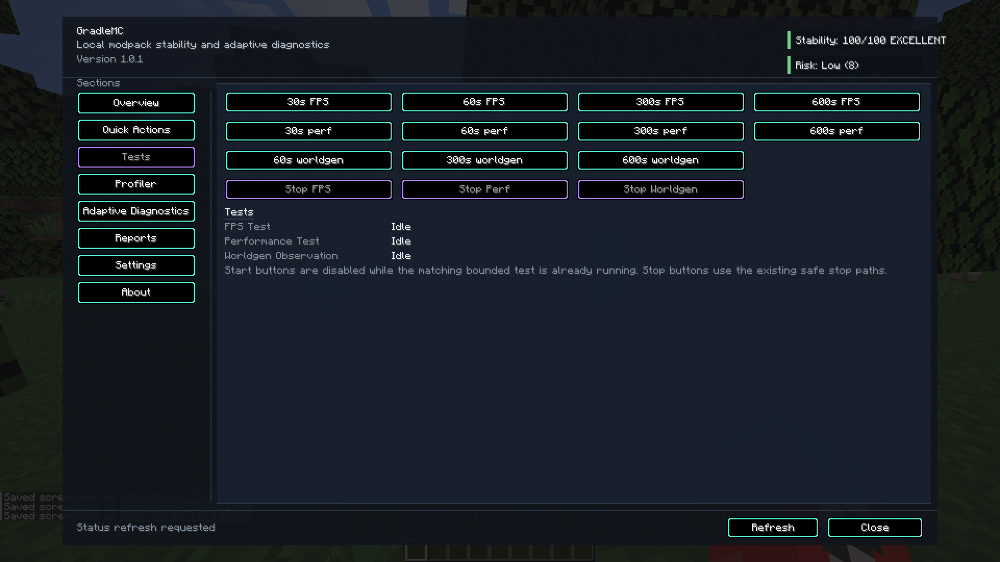
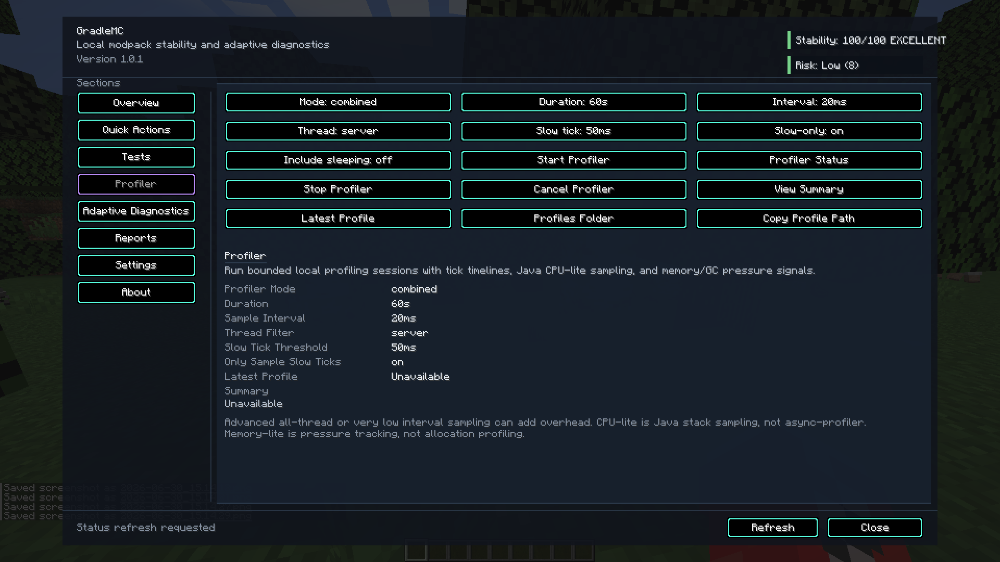
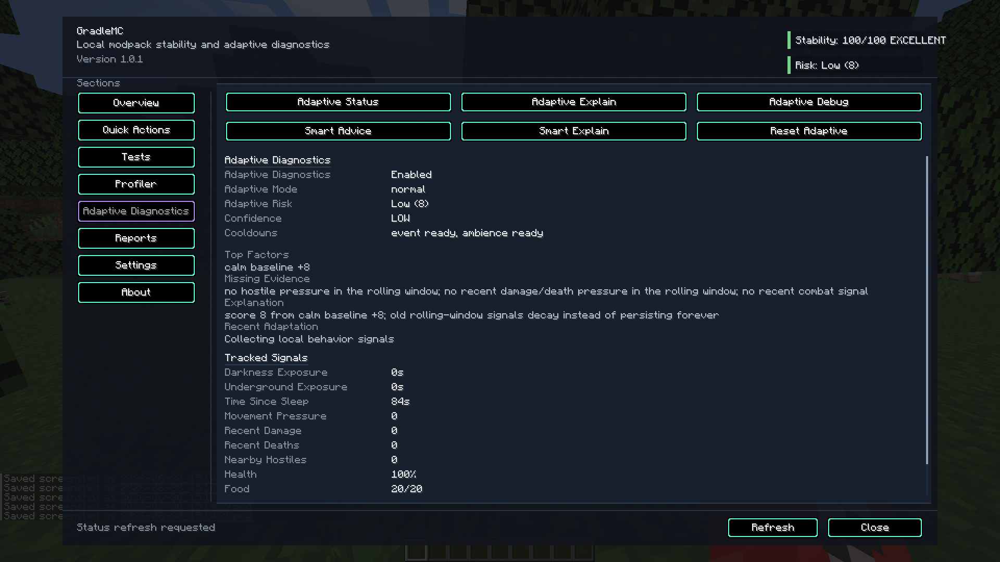
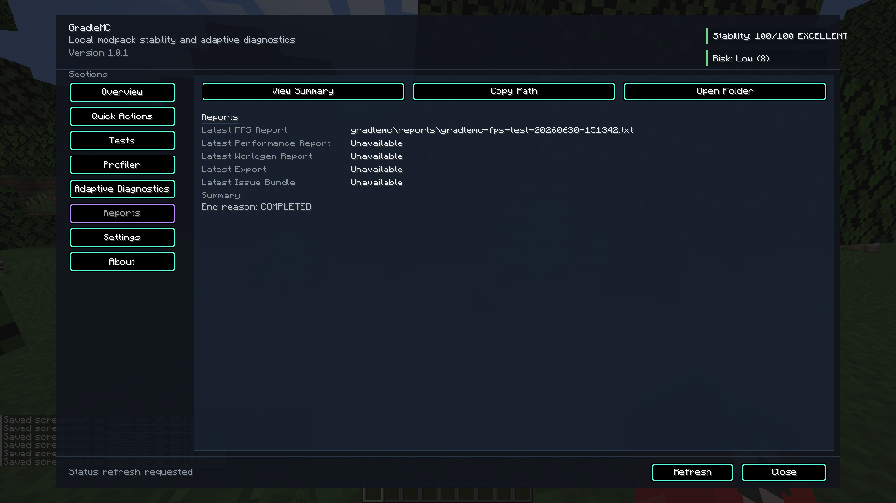
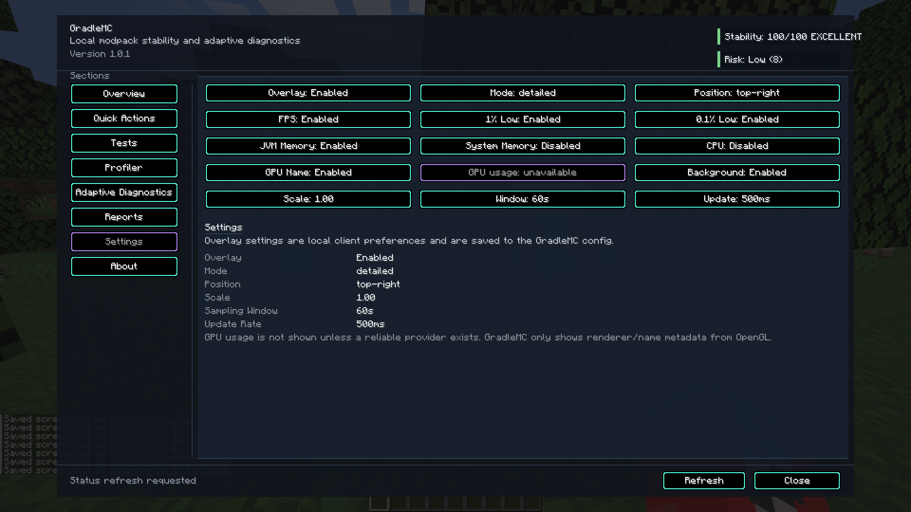
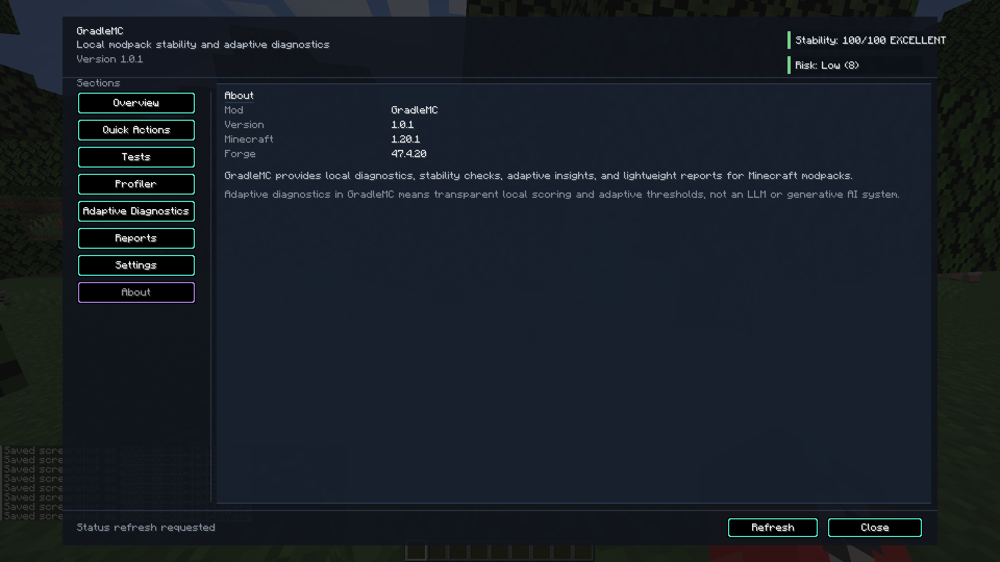
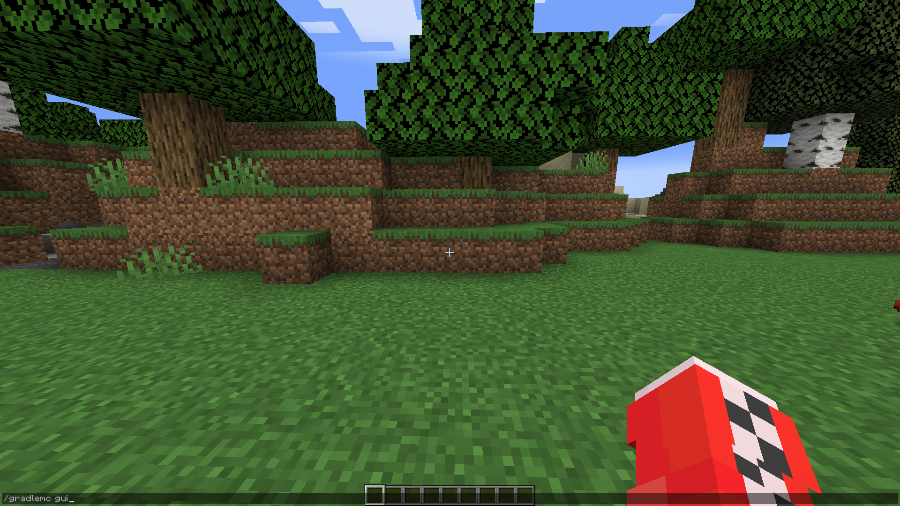
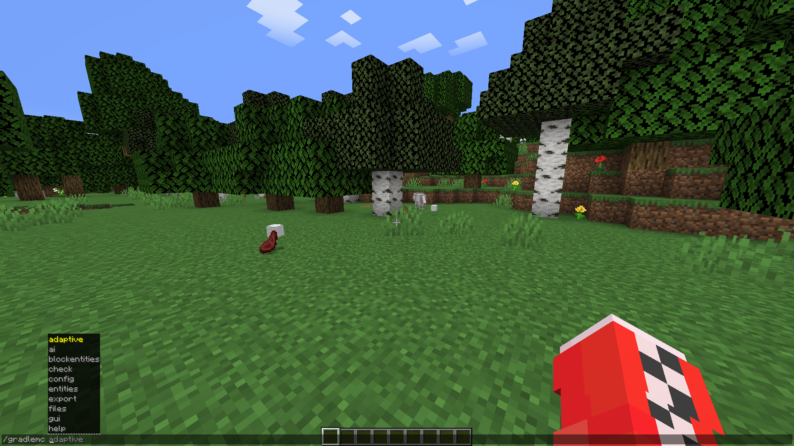
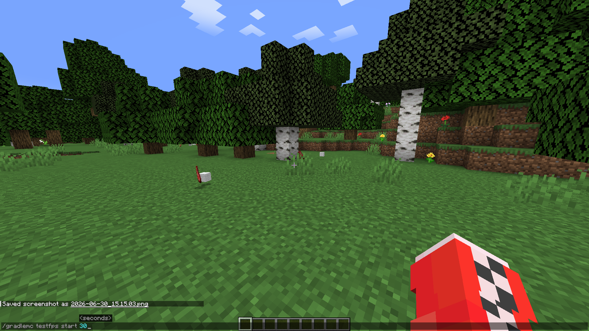
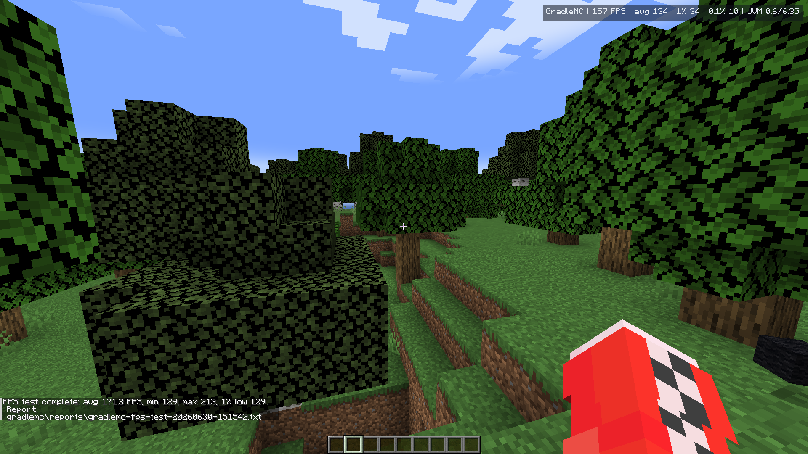

# GradleMC Screenshots

This page is the full visual inventory for the screenshots currently committed to the repository.

The screenshot assets live in [`../Screenshots/`](../Screenshots/). The folder name is capitalized, and GitHub paths are case-sensitive.

---

## README Preview Set

The README uses a compact preview so the landing page does not become an image dump.

<p align="center">
  
</p>

| README thumbnail 1 | README thumbnail 2 | README thumbnail 3 |
| --- | --- | --- |
|  |  |  |

---

## Full Screenshot Gallery

| # | Screenshot |
| ---: | --- |
| 0 |  |
| 1 |  |
| 2 |  |
| 3 |  |
| 4 |  |
| 5 |  |
| 6 |  |
| 7 |  |
| 8 |  |
| 9 |  |
| 10 |  |
| 11 |  |
| 12 |  |
| 13 |  |

---

## What These Screenshots Prove

These screenshots are evidence for the documented GradleMC UI and user-facing flow. A screenshot captured from one loader or Minecraft version must not be used as proof that another target was runtime-tested.

Current public release families are:

- Forge, Fabric, and NeoForge for Minecraft `1.21.11`;
- Forge, Fabric, and Quilt for Minecraft `1.20.1`;
- Forge, Fabric, and NeoForge for Minecraft `26.1.2`.

The screenshots do **not** prove support for Bedrock, cloud AI, telemetry, or any loader/version pair absent from the supported-release matrix. Screenshots are evidence, not marketing fog.

---

## Maintenance Rules

- Keep screenshot links relative so they render on forks and branches.
- Keep the README preview small; use this page for the full gallery.
- If screenshots are renamed, update `README.md`, this file, and `docs/SCREENSHOT_PLAN.md` in the same commit.
- If screenshots are recaptured, verify the release jar, Minecraft version, loader version, Java version, and command casing first.
- Prefer descriptive filenames in future cleanup work, but only rename files when every reference is updated.

---

## Future Naming Cleanup

The current screenshot set uses numbered files: `0.png` through `13.png`. That is acceptable because the links are documented and stable.

A future focused cleanup may rename them to descriptive lowercase kebab-case names such as:

```text
gui-overview.png
status-panel.png
smart-diagnostics.png
report-export.png
stats-overlay.png
```

Do not casually rename screenshot files while changing unrelated code.
