# GradleMC Screenshots

This page is the visual inventory for screenshots currently committed to the repository.

The assets live in [`../Screenshots/`](../Screenshots/). GitHub paths are case-sensitive.

---

## README Preview Set

<p align="center">
  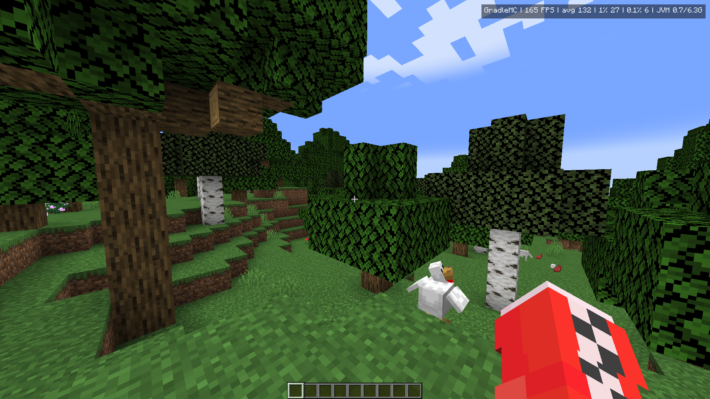
</p>

| README thumbnail 1 | README thumbnail 2 | README thumbnail 3 |
| --- | --- | --- |
| 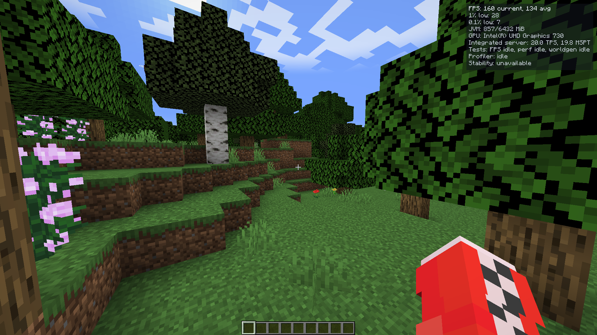 | 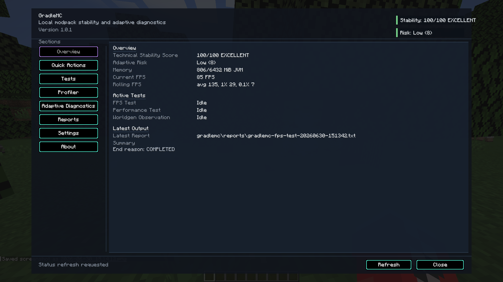 | 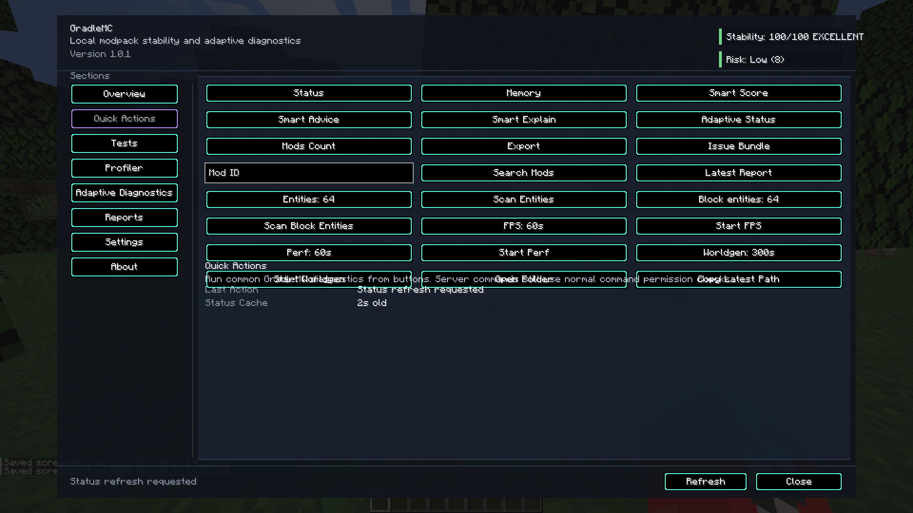 |

---

## Full Screenshot Gallery

| # | Screenshot |
| ---: | --- |
| 0 |  |
| 1 |  |
| 2 |  |
| 3 |  |
| 4 | 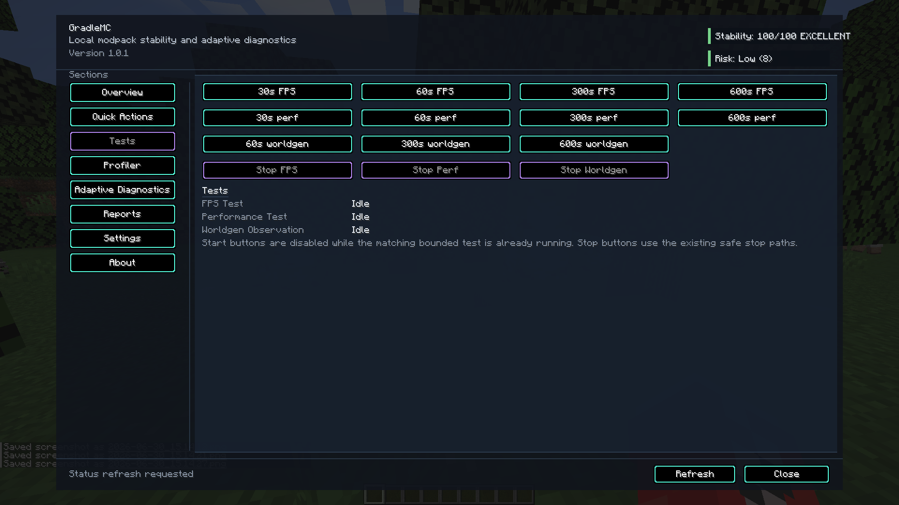 |
| 5 | 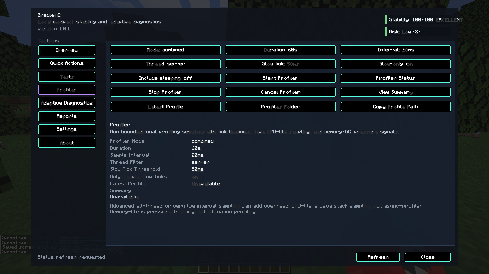 |
| 6 | 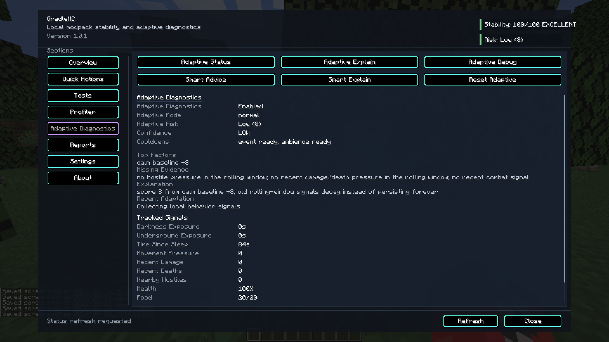 |
| 7 | 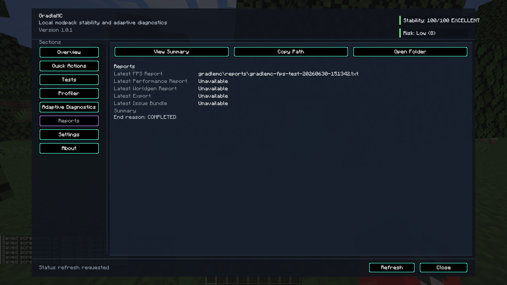 |
| 8 | 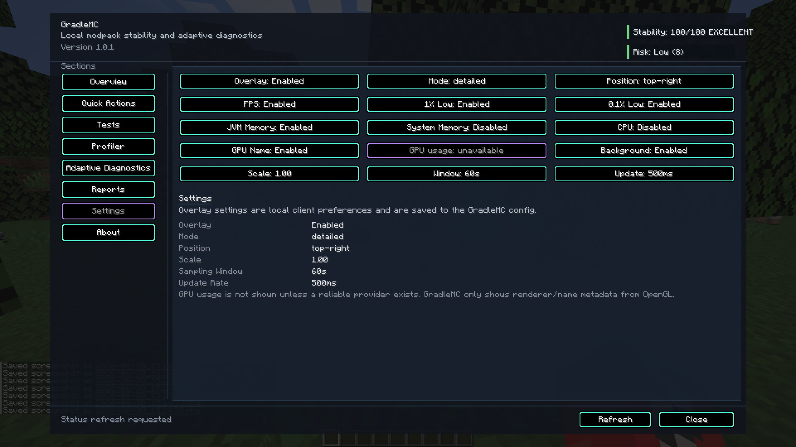 |
| 9 | 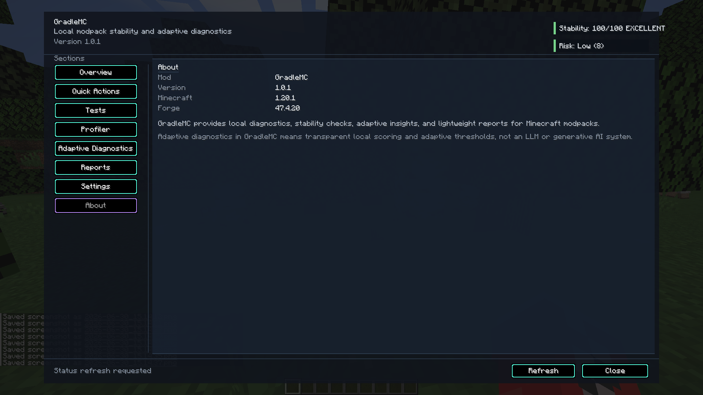 |
| 10 | 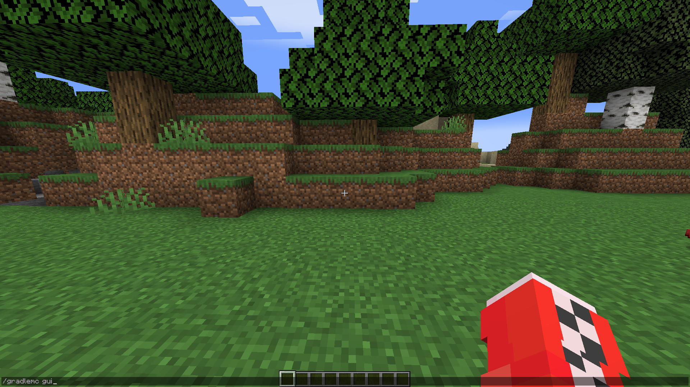 |
| 11 | 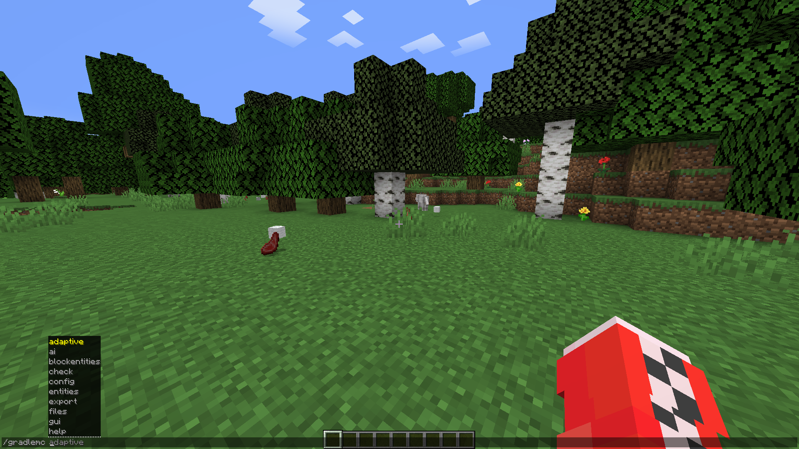 |
| 12 | 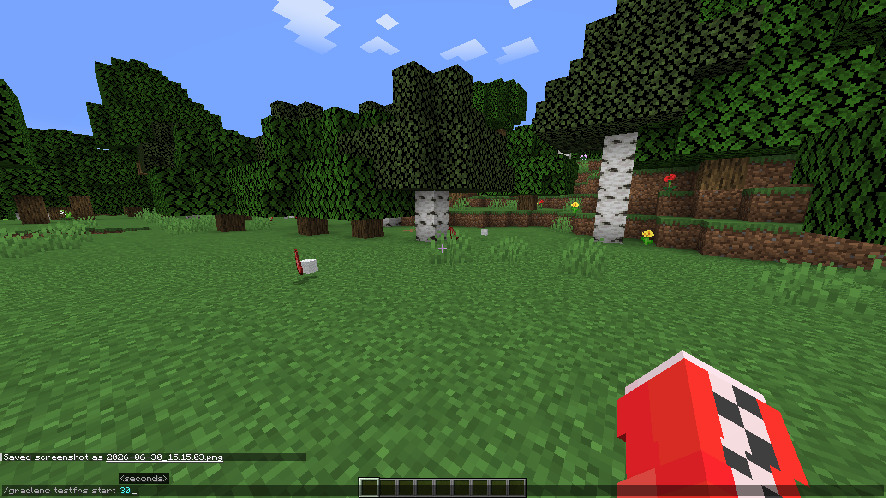 |
| 13 | 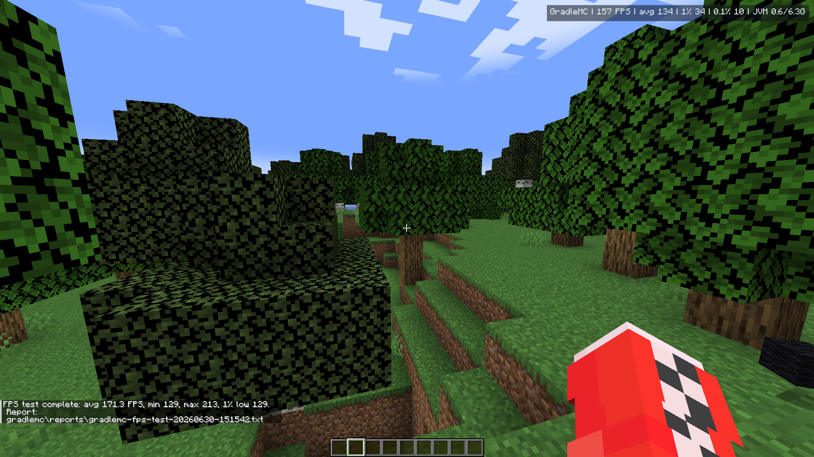 |

---

## What These Screenshots Prove

Screenshots are evidence only for the build and environment they were actually captured from. A screenshot from one loader/version must not be used as proof that another target was runtime-tested.

Current release context includes:

- Forge `1.20.1` GradleMC `v1.1.0`, implemented in Kotlin and requiring Kotlin for Forge;
- Fabric `1.20.1` existing published release;
- Forge, Fabric, and NeoForge for Minecraft `1.21.11`;
- Forge, Fabric, and NeoForge for Minecraft `26.1.2`;
- Quilt `1.20.1` only as a **legacy/discontinued** GradleMC line with no new versions planned.

Unless a screenshot was explicitly captured from Forge `1.20.1` GradleMC `v1.1.0`, it must not be treated as visual proof of the Kotlin release. Existing screenshots may represent earlier GradleMC versions.

The screenshots do **not** prove Bedrock support, cloud AI, telemetry, or any loader/version pair absent from the release matrix. Pixels are evidence, not a compatibility certificate.

---

## Maintenance Rules

- Keep screenshot links relative so they render on forks and branches.
- Keep the README preview small; use this page for the full gallery.
- If screenshots are renamed, update `README.md`, this file, and `docs/SCREENSHOT_PLAN.md` together.
- If screenshots are recaptured, record the GradleMC version, Minecraft version, loader, Java version, and required dependencies.
- Forge `1.20.1` `v1.1.0` captures should be made with Kotlin for Forge installed.
- Do not use legacy Quilt screenshots to imply active Quilt support.
- Do not expose sensitive paths, usernames, private server details, or secrets.

---

## Future Naming Cleanup

The current screenshot set uses numbered files: `0.png` through `13.png`. That is acceptable because the links are stable.

A future focused cleanup may rename them to descriptive lowercase kebab-case names such as:

```text
gui-overview.png
status-panel.png
smart-diagnostics.png
report-export.png
stats-overlay.png
```

Do not casually rename screenshot files while changing unrelated code.
